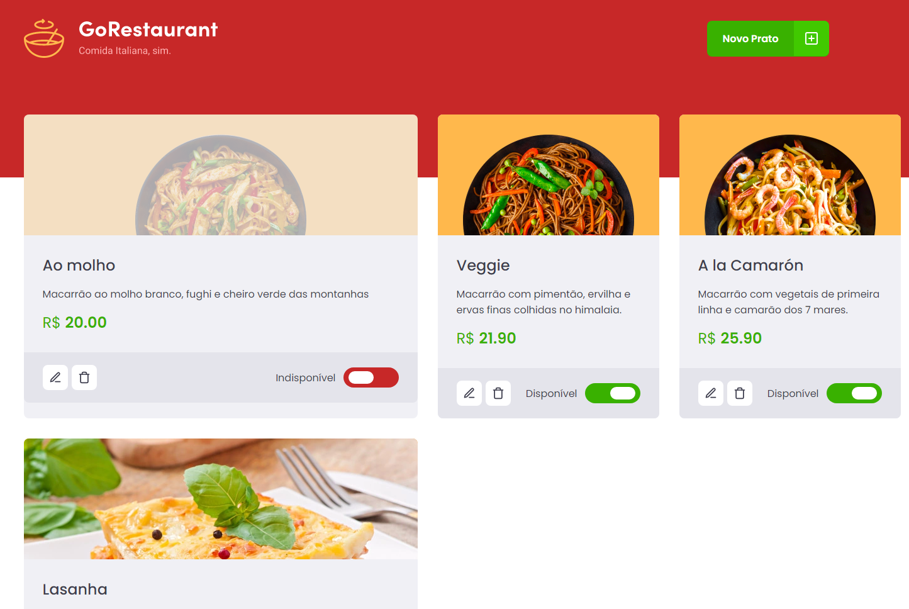

# Desafio 02 - Refactoring de classes e typescript

<p align="center">


</p>

<br>

<p align="center"><em>Confira o resultado do desafio em: <a href="https://gorestaurant-vitor.netlify.app" target="_blank">gorestaurant-vitor.netlify.app</a></em></p>

## :computer: Sobre o desafio

<hr>

Nesse desafio, você deverá criar uma aplicação para treinar o que aprendeu até agora no ReactJS

Essa será uma aplicação já funcional onde o seu principal objetivo é realizar dois processos de migração: de Javascript para Typescript e de Class Components para Function Components.

A seguir veremos com mais detalhes o que e como precisa ser feito 🚀

## Imagens

<div>
   
   
</div>

## :rocket: Techs

<ul>
  <li> HTML</li>
  <li> Styled Components </li>
  <li> Javascript </li>
  <li> TypeScript </li>
  <li> ReactJS </li>
  <li> React Modal </li>
  <li> React Icons </li>
  <li> JSON Server </li>
  <li> Axios </li>
</ul>

## Desenvolvimento

---

### Pré-requisitos

- Instalar [Node.js](https://nodejs.org)

- Instalar [Yarn](https://yarnpkg.com/)

### Clone o repositório

```bash
$ git@github.com:vitorgaletti/ignite-reactjs-gorestaurant.git
```

### Executar Projeto

```bash
# Mudar para directório
$ cd ignite-reactjs-gorestaurant/
```

- Instalar dependências

```bash
$ yarn
```

- Execute

```bash
$ yarn server
```

```bash
$ yarn start
```

- Executar scripts

|          Ação          |  Utilização   |
| :--------------------: | :-----------: |
| Iniciar o JSON Server  | `yarn server` |
|   Iniciar o servidor   | `yarn start`  |
| Compilar para produção | `yarn build`  |
